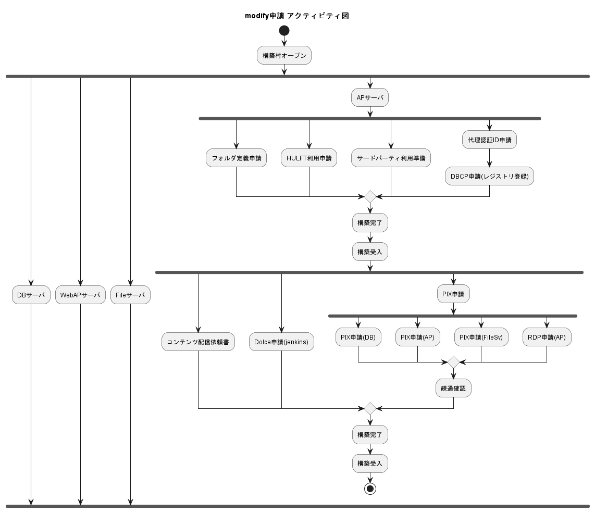

# PJ標準化に向けた構想と妄想

PJ標準化だけに限らずドキュメント生成の手法を確立しよう！

## ゴール

- みんな大好きExcelファイルの生成
- バージョン管理、差分確認が容易
- markdownとsvgで書く

## 手段

vscodeで書く、Linterで整形と入力補助
作図は `Draw.io Integration` や `Inkscape` などのローカルツール
`Draw.io` や `figma` など外部サイトでも可能(なはず)
テーブルは Ecxel からのコピペが楽？
アシストできるような Extention があれば利用する

## 手法

`pandoc` のようなドキュメント変換ツールを用いる、が！
node.js で 同じようなことできるんじゃない？

### アプローチ

- 出力
node で Excel が扱えるのは確認済み
[xlsx - npm](https://www.npmjs.com/package/xlsx)

- 入力
markdownパーサーも node で可能
[markdown-it - npm](https://www.npmjs.com/package/markdown-it)
プラグインで記法を拡張できそうな感触があり

- 合成
svg でヘッダー周りのテンプレートを合成する
拡張した記法を読み込んで、タイトルや必須項目、改版履歴など生成して合成する

### アイディア

- レビュー等のコメントはhtmlコメント？
<!-- もっと markdownらしいコメントとしたい-->
[imo]こういうのとか？
[must]とか

- 技術評論社の拡張記法をパクる

1. 章立て
   1. A
   2. B
      1. BB
   3. C
      1. CC
         1. ccc
         2. ccc
         3. ccc
      2. CC
   4. D
1. 終わり

## 実装

```typescript
import { NestFactory } from '@nestjs/core';
import { AppModule } from './app.module';
import { AppService } from './app.service';
import * as fs from 'fs';

const xl = require('excel4node');
const sharp = require('sharp');
const dfd = require('danfojs-node');

async function bootstrap() {
  const app = await NestFactory.create(AppModule);
  const appService = app.get(AppService);

  const arr_data = [
    [1, 'hello', 3.2],
    [5, 'danfojs', 7.5],
    [3, 'javascipt', 10.0],
  ];

  const df = new dfd.DataFrame(arr_data);
  df.print();

  console.log(appService.getHello());
}
bootstrap();

```


